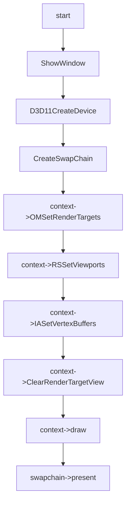

# CLIPPINIG Feature

## 01:02_case_clipping_with_clipdistance

### 用例输入：


```
如上，vs输入数据为3组positon以及color和culldistance,绘制模式为triangle_list，主要测试clipdistance该系统变量的功能
```


### 处理流程：




```hlsl
inc:
struct VertexIn
{
    float4 pos : POSITION;
    float4 color : COLOR;
    float clipdistance : CLIPDISTANCE;
};

struct VertexOut
{
    float4 pos : SV_Position;
    float4 color : COLOR;
    float clipdistance : SV_ClipDistance;
};
```

```hlsl
vs_src:
VertexOut VS (VertexIn vIn)
{
    VertexOut vOut;
    vOut.pos = vIn.pos;
    vOut.color = vIn.color;
    vOut.clipdistance = vIn.clipdistance;//这里直接定义没有自定义plane,直接设置clipdistance的绝对值
    return vOut;
}
```

```hlsl
ps_src:
float4 PS(VertexOut pIn):SV_Target
{ 
    return pIn.color;
}
```


### 预期输出：


```
如上，最终窗口会有一个不完整的三角形绘制，右下角由于插值时clipdistance的值<0,未进行绘制
```

