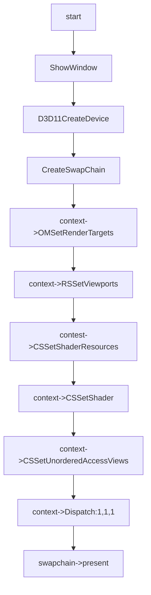

# CS Feature

## 01:case cs

### 用例输入：


```
如上,cs的输入为4x4的texture
```


### 处理流程：




```hlsl
cs_src:
Texture2D g_Tex : register(t0);

RWTexture2D<unorm float4> g_Output : register(u0);
//1个线程组中线程个数
[numthreads(4,4,1)]

void CS(uint3 DTid:SV_DispatchThreadID)
{
    g_Output[DTid.xy] = g_Tex[DTid.xy];
}
```


### 预期输出：


```
如上，uav中的数据是原样获取的texture_2d中的数据
```

