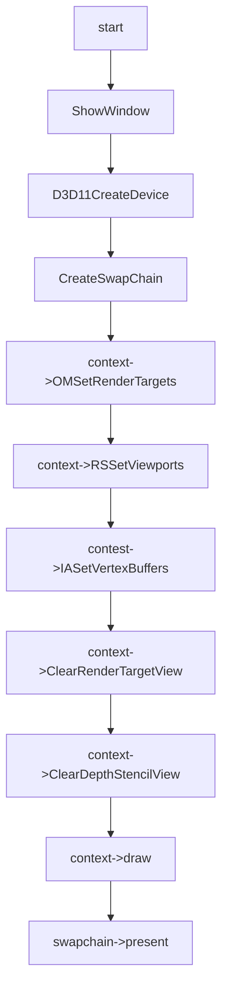

# Depth Test Feature

## 01:case depth test enable

### 用例输入：


```
如上，vs输入数据为六组positon以及color,绘制模式为triangle_list
```


### 处理流程：




```hlsl
inc:
struct VertexIn
{
    float4 pos : POSITION;
    float4 color : COLOR;    
};

struct VertexOut
{
    float4 posH : SV_POSITION;
    float4 color : COLOR;
};
```

```hlsl
vs_src:

VertexOut VS(VertexIn vIn)
{
    VertexOut vOut;
    vOut.posH = vIn.pos;
    vOut.color = vIn.color;
    return vOut;
}
```

```hlsl
ps_src:

float4 PS(VertexOut pIn):SV_Target
{    
    return pIn.color;
}
```


### 预期输出：


```
如上，最终会有两个三角形绘制，像素重叠部分的颜色应为红色。
```

