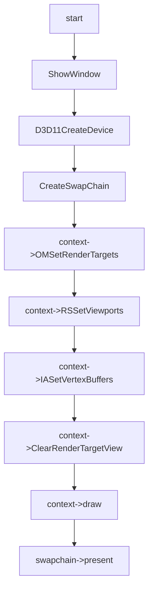

# Draw Mode Feature

## 01:case draw_triangle

### 用例输入：


```
如上，vs输入数据为三组positon以及color,绘制模式为triangle_list
```


### 处理流程：




```hlsl
inc:
struct VertexIn
{
    float4 pos : POSITION;
    float4 color : COLOR;    
};

struct VertexOut
{
    float4 posH : SV_POSITION;
    float4 color : COLOR;
};
```

```hlsl
vs_src:


VertexOut VS(VertexIn vIn)
{
    VertexOut vOut;
    vOut.posH = vIn.pos;
    vOut.color = vIn.color;
    return vOut;
}
```

```hlsl
ps_src:


float4 PS(VertexOut pIn):SV_Target
{    
    return pIn.color;
}
```


### 预期输出：


```
如上，最终窗口会有红色三角形绘制。
```

