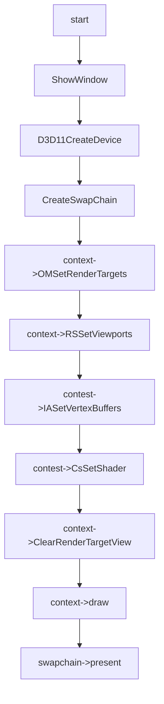

# Draw Mode Feature

## 01:case draw_triangle

### 用例输入：


```
如上，vs输入数据为三组positon以及color,绘制模式为triangle_list,gs 的输出设置为pointstream
```


### 处理流程：




```hlsl
inc:
struct VertexIn
{
    float4 pos : POSITION;
    float4 color : COLOR;    
};

struct VertexOut
{
    float4 posH : SV_POSITION;
    float4 color : COLOR;
};
```

```hlsl
vs_src:


VertexOut VS(VertexIn vIn)
{
    VertexOut vOut;
    vOut.posH = vIn.pos;
    vOut.color = vIn.color;
    return vOut;
}
```

```hlsl
ps_src:


float4 PS(VertexOut pIn):SV_Target
{    
    return pIn.color;
}
```

```
gs_src:
[maxvertexcount(3)]
void GS(triangle VertexOut input[3], inout PointStream<VertexOut> output)
{
    
    int i = 0;
    for (i = 0; i < 3;i++)
    {
        VertexOut element;
        element.color = input[i].color;
        element.posH = input[i].posH;
        output.Append(element);
    }
}


```


### 预期输出：


```
如上，最终窗口会有三个点绘制
```

