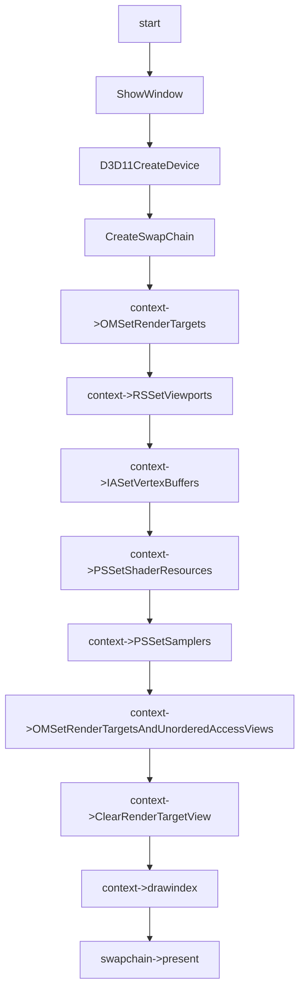

# Image load Store Feature

## 01: case image load store

### 用例输入：


```
如上，vs输入数据为六组positon以及color和texcoord,绘制模式为triangle_list,输出将会有两个目标，将纹理中的数据原样输出到uav中以及交换链中的buffer中
```

### 处理流程：




```hlsl
inc:
struct vertexIn
{
    float4 pos : POSITION;
    float4 color : COLOR;
    float2 texcoord : TEXCOORD;
};


struct vertexOut
{
    float4 pos : SV_Position;
    float4 color : COLOR;
    float2 texcoord : TEXCOORD;
};

```

```hlsl
vs_src:
vertexOut VS(vertexIn pIn)
{
    vertexOut vOut;
    vOut.color = pIn.color;
    vOut.pos = pIn.pos;
    vOut.texcoord = pIn.texcoord;
    
    return vOut;
}

```

```hlsl
ps_src:
Texture2D gTex : register(t0);

RWTexture2D<float4 > gOutput : register(u1);

float4 PS(vertexOut pIn) :SV_Target
{    
    uint3 iLocation = uint3(pIn.texcoord.x *4,pIn.texcoord.y*4,0);
    
    float4 fragColor = gTex.Load(iLocation); 
    gOutput[iLocation.xy] = fragColor;
    return fragColor;
}
```


### 预期输出：


```
如上，会有四色纹理输出
```

