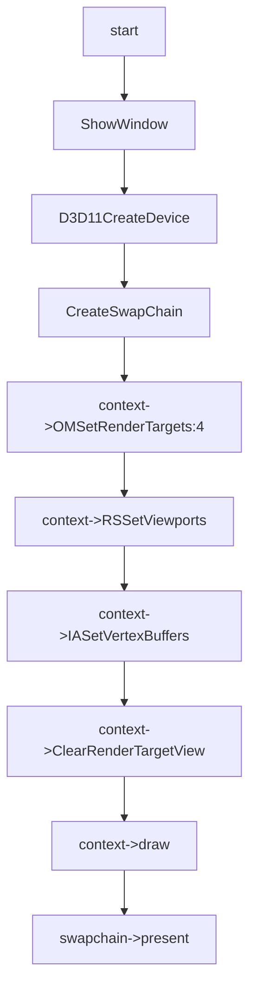

# Mrt Feature

## 01:case 4mrt

### 用例输入：


```
如上，vs输入数据为三组positon以及color,绘制模式为triangle_list,输出为4个 rendertarget
```


### 处理流程：




```hlsl
inc:
struct VertexIn
{
    float4 pos : POSITION;
    float4 color : COLOR;    
};

struct VertexOut
{
    float4 posH : SV_POSITION;
    float4 color : COLOR;
};

struct psOut
{
    float4 fragColor0 : SV_Target0;
    float4 fragColor1 : SV_Target1;
    float4 fragColor2 : SV_Target2;
    float4 fragColor3 : SV_Target3;    
};
```

```hlsl
vs_src:
VertexOut VS(VertexIn vIn)
{
    VertexOut vOut;
    vOut.posH = vIn.pos;
    vOut.color = vIn.color;
    return vOut;
}
```

```hlsl
ps_src:

psOut PS(VertexOut pIn)
{   
    psOut pOut;
    pOut.fragColor0 = float4(0.0f, 1.0f, 0.0f, 1.0f);
    pOut.fragColor1 = float4(0.0f, 0.0f, 1.0f, 1.0f);
    pOut.fragColor2 = float4(0.0f, 1.0f, 1.0f, 1.0f);
    pOut.fragColor3 = pIn.color;
    return pOut;
}
```

### 预期输出：


```
如上，最终会有4个target 被绘制
```

