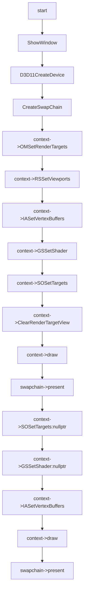

# Stream Output Feature

## 01:case stream output

### 用例输入：


```
如上,draw共绘制两次，第一次使用 stream_output,第二次将stream_output 的输出再进行绘制一次
```


### 处理流程：




```hlsl
inc:
struct VertexIn
{
    float4 pos : POSITION;
    float4 color : COLOR;    
};

struct VertexOut
{
    float4 posH : SV_POSITION;
    float4 color : COLOR;
};
```

```hlsl
vs_src:

VertexOut VS(VertexIn vIn)
{
    VertexOut vOut;
    vOut.posH = vIn.pos;
    vOut.color = vIn.color;
    return vOut;
}
```

```hlsl
ps_src:


float4 PS(VertexOut pIn):SV_Target
{    
    return pIn.color;
}
```

```
gs_src:
[maxvertexcount(3)]
void GS(triangle VertexOut input[3], inout PointStream<VertexOut> output)
{
    int i = 0;
    for (i = 0; i < 3;i++)
    {
        VertexOut element;
        element.color = input[i].color;
        element.posH = float4(input[i].posH.x + 0.1, input[i].posH.yzw);
        output.Append(element);        
    }
}
```


### 预期输出：


```
如上，最终窗口会有红色三角形绘制。
```

