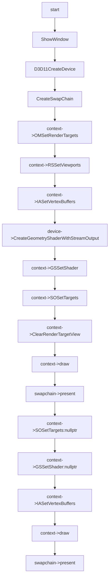

# Stream Output Feature

## 02:case stream output with patch list

### 用例输入：


```
如上,draw共绘制两次，第一次使用 stream_output,输入模式设置为 D3D11_PRIMITIVE_TOPOLOGY_4_CONTROL_POINT_PATCHLIST,第二次将stream_output 的输出再进行绘制一次,输入模式设置为D3D11_PRIMITIVE_TOPOLOGY_POINTLIST,该测试是为了验证PRIMITIVE_TOPOLOGY 设置为PATCHLIST,对so接受数据的影响
```


### 处理流程：




```hlsl
inc:
struct VertexIn
{
    float4 pos : POSITION;
};

struct VertexOut
{
    float4 pos : SV_Position;  
};
```

```hlsl
vs_src:
VertexOut VS(VertexIn vIn)
{
    VertexOut vOut;
    vOut.pos = vIn.pos;
    return vOut;
}
```

```hlsl
ps_src:
float4 PS(float4 pos :SV_Position ):SV_Target
{    
    return float4(1.0f, 0.0f, 0.0f, 1.0f);
}
```


### 预期输出：


```
如上，最终窗口会有8个点绘制，说明有8个元素进入了so
```

