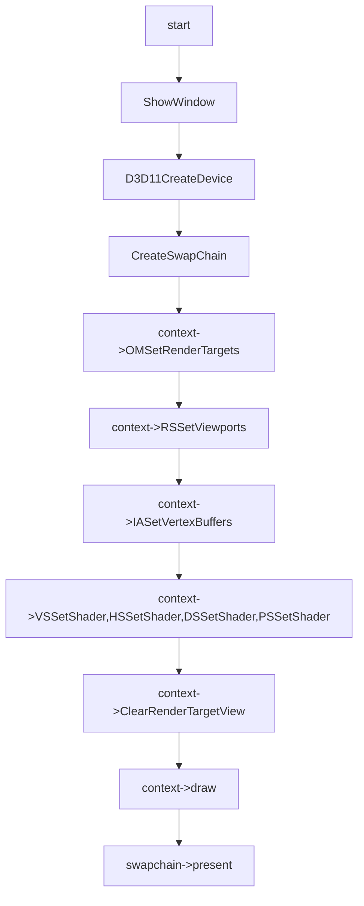

# Tess Feature

## 01:case tess triangles 

### 用例输入：


```
如上，vs输入数据为三组positon以及color,绘制模式为D3D_PRIMITIVE_TOPOLOGY_3_CONTROL_POINT_PATCHLIST
```


### 处理流程：




```hlsl
inc:
struct VertexIn
{
    float3 pos : POSITION;  
};

struct VertexOut
{
    float3 posH : POSITION;
};

typedef VertexOut HullOut;

struct triPatchTess
{
    float edgeTess[3] : SV_TessFactor;
    float insideTess[1] : SV_InsideTessFactor;
};

triPatchTess triConstantHS(InputPatch<VertexOut, 3> patch, uint patchId : SV_PrimitiveID)
{
    triPatchTess pt;
    pt.edgeTess[0] = 2.0f;
    pt.edgeTess[1] = 2.0f;
    pt.edgeTess[2] = 2.0f;
    pt.insideTess[0] = 2.0f;
    return pt;
}
```

```hlsl
vs_src:
VertexOut VS(VertexIn pIn)
{
    return pIn;
}
```

```hlsl
hs_src:
[domain("tri")]
[partitioning("integer")]
[outputtopology("triangle_cw")]
[outputcontrolpoints(3)]
[patchconstantfunc("triConstantHS")]

float3 HS(InputPatch<VertexOut,3> patch, uint i : SV_OutputControlPointID, uint patchId : SV_PrimitiveID):POSITION
{
    return patch[i].posH;   
}
```

```
ds_src:
[domain("tri")]
float4 DS(triPatchTess patchTess, float3 weights : SV_DomainLocation, OutputPatch<HullOut, 3> tri) : SV_POSITION
{
    float3 dsOut = tri[0].posH * weights[0] +
                 tri[1].posH * weights[1] +
                 tri[2].posH * weights[2];
    return float4(dsOut, 1.0f);
}
```

```hlsl
ps_src:
float4 PS(float4 PosH :SV_Position):SV_Target
{    
    return float4(1.0f,0.0f,0.0f,1.0f);
}
```


### 预期输出：


```
如上，三角形线框绘制
```

