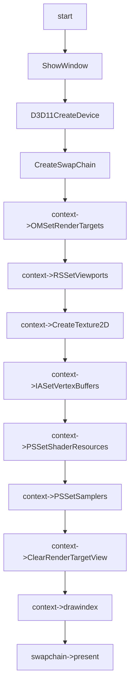

# Texture Feature

## 03:case texture 2d array rgba8

### 用例输入：


```
如上，vs输入数据为六组positon以及color和texcoord,绘制模式为triangle_list，并有texture array 2输入
```

### 处理流程：




```hlsl
inc:
Texture2DArray gTexArr : register(t0);

SamplerState gSamLinear : register(s0);

struct VertexIn
{
    float4 pos : POSITION;
    float4 color : COLOR; 
    float2 tex : TEXCOORD;
};

struct VertexOut
{
    float4 posH : SV_POSITION;
    float4 color : COLOR;
    float2 tex : TEXCOORD;
};

```

```hlsl
vs_src:
VertexOut VS(VertexIn vIn)
{
    VertexOut vOut;
    vOut.posH = vIn.pos;
    vOut.color = vIn.color;
    vOut.tex = vIn.tex;
    return vOut;
}
```

```hlsl
ps_src:
float4 PS(VertexOut pIn):SV_Target
{
    return gTexArr.SampleLevel(gSamLinear, float3(pIn.tex, pIn.tex.x), 0.0f);
}
```


### 预期输出：


```
如上，会有texture array 中的纹理混合输出，输出纹理左边是array0的纹理，右边是arrar1的纹理
```

