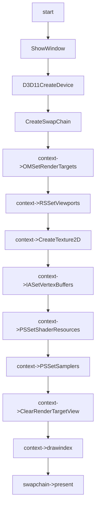

# Texture Feature

## 04:case texture cube rgba8

### 用例输入：


```
如上，vs输入数据为六组positon以及color和texcoord,绘制模式为triangle_list，以及texture cube,分别为 x+,x-,y+,y-,z+,z-
```

### 处理流程：




```hlsl
inc:
TextureCube gTexCube : register(t0);
SamplerState gSamLinear : register(s0);

struct VertexIn
{
    float4 pos : POSITION;
    float4 color : COLOR; 
};

struct VertexOut
{
    float4 posH : SV_POSITION;
    float4 color : COLOR;
    float3 cubePos : POSITION;
};
cbuffer constantMat : register(b0)
{
    matrix modelMat;
    matrix viewMat;
    matrix projectMat;    
}

```

```hlsl
vs_src:
VertexOut VS(VertexIn vIn)
{
    VertexOut vOut;
    vOut.posH = mul(vIn.pos, modelMat);
    vOut.posH = mul(vOut.posH, viewMat);
    vOut.posH = mul(vOut.posH, projectMat);    
    vOut.cubePos = float3(vIn.pos.xyz);
    vOut.color = vIn.color;
    return vOut;
}
```

```hlsl
ps_src:
float4 PS(VertexOut pIn):SV_Target
{    
    return gTexCube.Sample(gSamLinear, float3(pIn.cubePos.xyz));
}

```


### 预期输出：


```
如上，会有cube绘制，各个面使用texture cube 对应面的纹理
```


