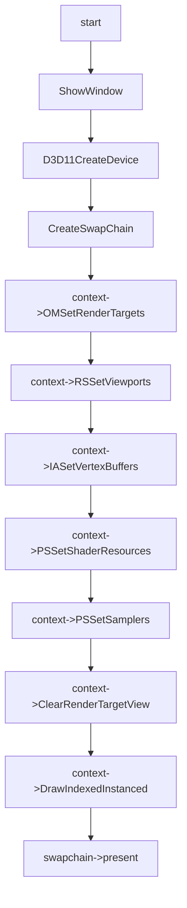

# Texture Feature

## 05:case texture cube array rgba8

### 用例输入：


```
如上，vs输入数据为六组positon以及color和texcoord,绘制模式为triangle_list,以及输入为texture cube array3,各个array中的texture相同，如上为一个array中的六面cube数据,分别为x+,x-,y+,y-,z+,z-
```

### 处理流程：




```hlsl
inc:
Texture2D gTex : register(t0);
SamplerState gSamLinear : register(s0);

struct VertexIn
{
    float4 pos : POSITION;
    float4 color : COLOR; 
    float2 tex : TEXCOORD;
};

struct VertexOut
{
    float4 posH : SV_POSITION;
    float4 color : COLOR;
    float2 tex : TEXCOORD;
};

```

```hlsl
vs_src:
VertexOut VS(VertexIn vIn)
{
    VertexOut vOut;
    vOut.posH = vIn.pos;
    vOut.color = vIn.color;
    vOut.tex = vIn.tex;
    return vOut;
}

```

```hlsl
ps_src:
float4 PS(VertexOut pIn):SV_Target
{    
    return gTex.Sample(gSamLinear, pIn.tex);
}

```


### 预期输出：


```
如上，三个cube绘制，
```

