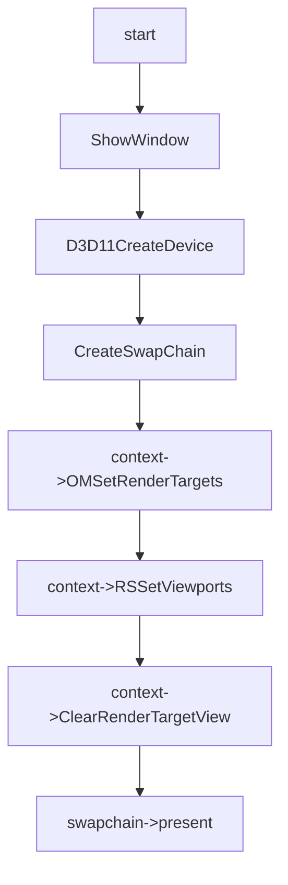

# Window Feature

## 01:case clear window

### 用例输入：

### 处理流程：


```mermaid
graph TD;
	start-->A[ShowWindow];
	A-->B[D3D11CreateDevice];
	B-->C[CreateSwapChain];
	C-->D[context->OMSetRenderTargets];
	D-->E[context->RSSetViewports];
	E-->F[context->ClearRenderTargetView];
	F-->G[swapchain->present]
	
```


### 预期输出：


```
如上，最终窗口会被绘制成蓝色
```

